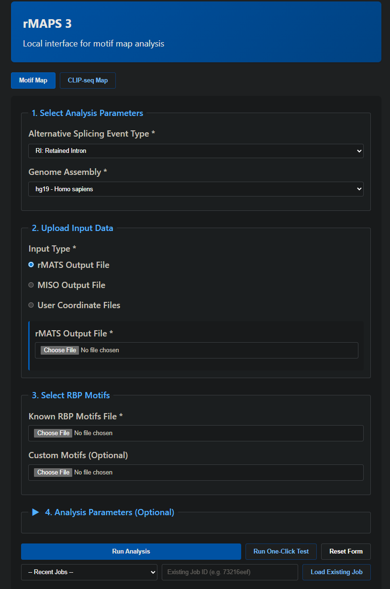
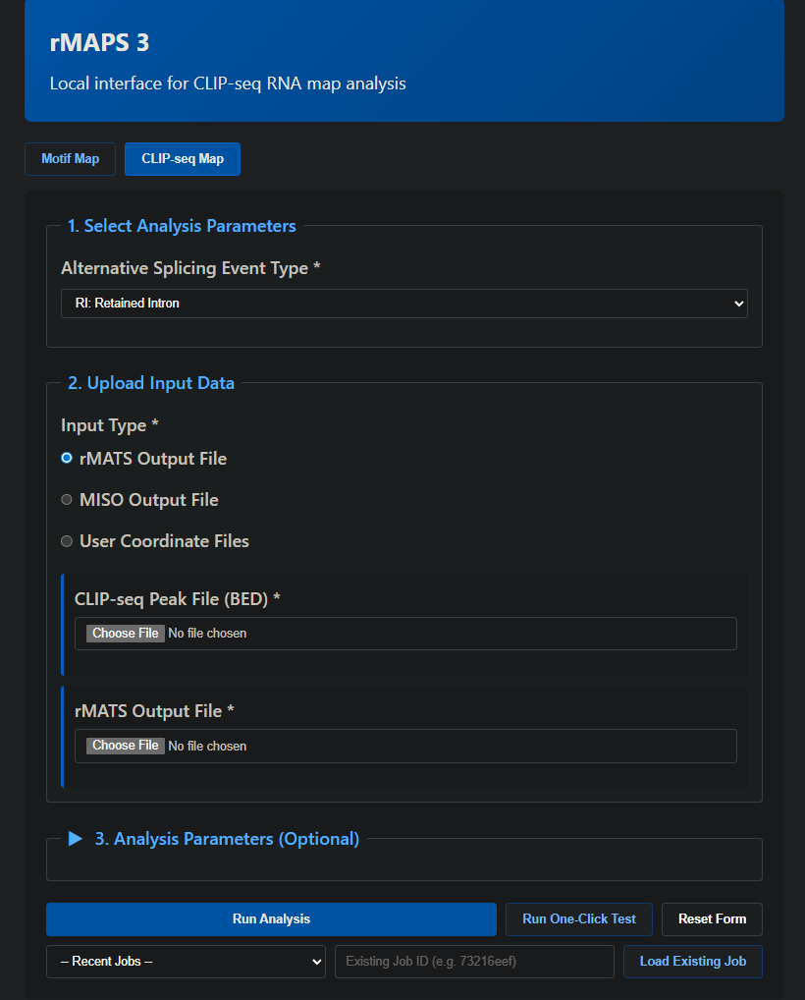
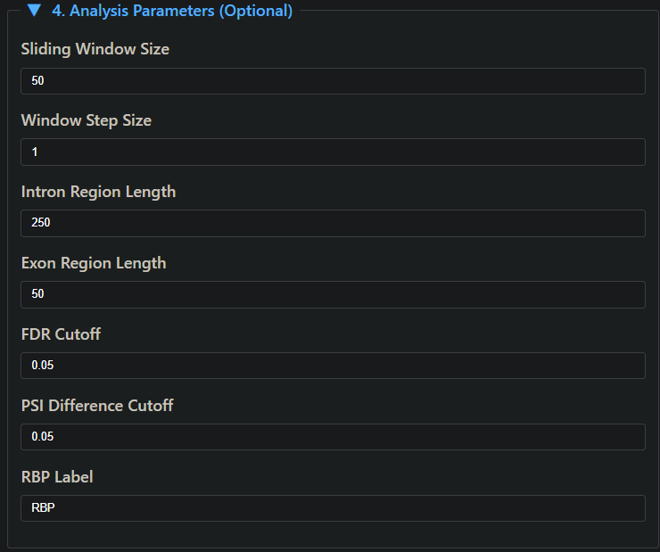
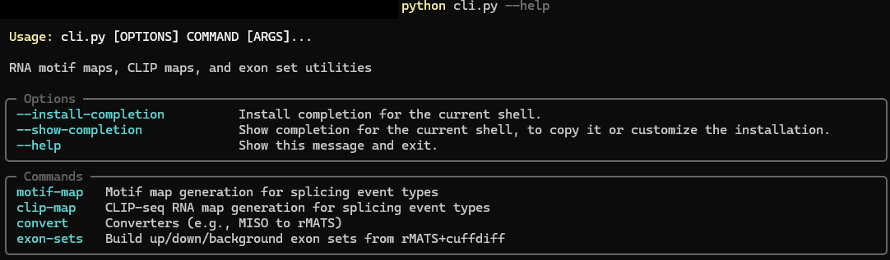
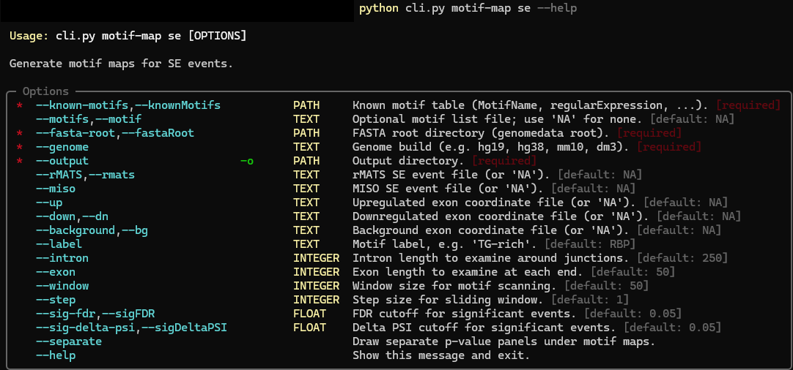

# rMAPS 3


RNA Map Analysis and Plotting Server (rMAPS) generates RNA maps for RNA-binding protein (RBP) analysis around alternative splicing events.

Original rMAPS website: http://rmaps.cecsresearch.org/

## What This Project Provides

- Original rMAPS motif-map and CLIP-map workflows updated for Python 3.
- Unified CLI in `cli.py` for motif maps, CLIP maps, MISO conversion, and exon-set generation.
- Local Web UI launcher in `run_web.py`.
- Selectable p-value methods in both CLI and Web UI: `fisher`, `mannwhitney_greater`, `brunnermunzel_greater`, and `permutation_one_sided`.

## Screenshots

### Web UI

Motif mode (collapsed optional parameters):



CLIP mode (collapsed optional parameters):



Optional analysis parameters (expanded):



### CLI

Global help:



Motif event-specific help:



## Requirements

- Python 3.10+
- Perl on `PATH` (for MISO converters)
- Flask (for Web UI)
- Optional: TeX distribution (PyX text rendering)
- Optional: Ghostscript (PNG export)

Install dependencies:

```bash
python -m pip install -r requirements.txt
```

## Documentation

- Installation and genome setup: [`docs/INSTALL.md`](docs/INSTALL.md)
- Full CLI reference and event-type details: [`docs/CLI_USAGE.md`](docs/CLI_USAGE.md)
- Web UI usage and API: [`webui/README.md`](webui/README.md)
- Testing guide: [`tests/README.md`](tests/README.md)
- Legacy test script notes: [`tests/legacy/README.md`](tests/legacy/README.md)

## Genome Data Layout

Genome FASTA files must be downloaded separately (not included in repo).

Use provided fetch scripts:
- **Windows:** `.\scripts\fetch_genomes.ps1 -Genomes hg19,hg38`
- **Linux/macOS:** `./scripts/fetch_genomes.sh --genomes hg19,hg38`

By default, files download to `genomedata/`. To use a different location, pass `--FastaRoot` (Windows) or `--fasta-root` (Linux/macOS) to the script, or set `$env:RMAPS_FASTA_ROOT` / `RMAPS_FASTA_ROOT` environment variable.

Expected layout after download:
```text
genomedata/
  hg19/hg19.fa
  hg38/hg38.fa
  mm10/mm10.fa
  ...
```

For full setup instructions, see [Installation Guide](docs/INSTALL.md).

## Project Structure

- `cli.py`: CLI entrypoint
- `run_web.py`: local web launcher
- `rmaps_core/`: shared dispatch and utility modules
- `legacy/`: event-specific engines invoked by the CLI
- `bin/`: helper scripts (`miso2rMATS.*.pl`, `RNA.map.noWiggle.py`, `getExonSets.py`)
- `data/`: motif reference inputs
- `data/test/`: bundled sample data
- `tests/`: Python test suites and legacy shell wrappers

## Quick Start

Show CLI help:

```bash
python cli.py --help
```

Run smoke checks:

```bash
python tests/smoke_cli.py
```

Run integration suites:

```bash
python tests/test_clip.py
python tests/test_motif.py --fasta-root genomedata --genome hg19
```

For full command reference (all event types and options), see [`docs/CLI_USAGE.md`](docs/CLI_USAGE.md).

## Web UI (Local)

```bash
python run_web.py
```

Open `http://127.0.0.1:5000`.

## Troubleshooting

- `FastaNotFoundError`: verify `--genome` and `--fasta-root` match `<build>/<build>.fa`.
- MISO conversion failures: ensure Perl is installed and `bin/miso2rMATS.*.pl` exists.
- Missing CLIP plots: ensure input yields non-empty up/down/background event groups.

